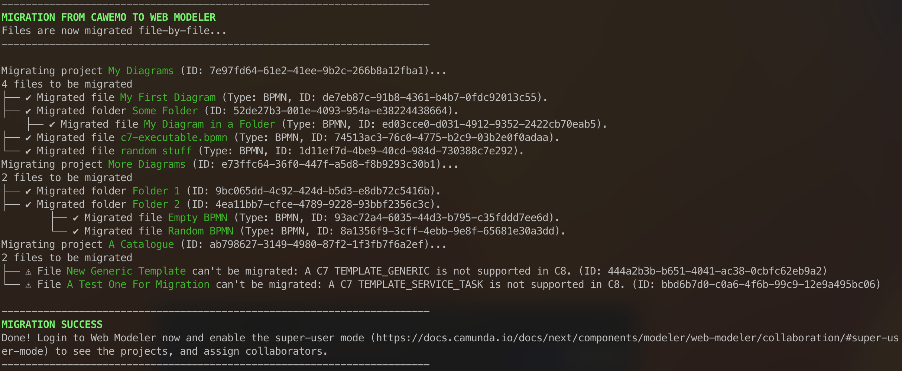

# Cawemo to Web Modeler Migration

This folder includes a bash script, a powershell script, and a Go script to migrate projects from Cawemo to Web Modeler.

## Prerequisites

* A Cawemo enterprise license to use the Cawemo API
* API credentials for Cawemo created by an Organization Admin ([read here](https://docs.camunda.org/cawemo/1.9/reference/rest-api/overview/authentication/) how to obtain them)
* An API client for Web Modeler ([read here](https://docs.camunda.io/docs/apis-tools/web-modeler-api/authentication/?authentication=saas) how to create one).
  * Bash 4 or newer, or zsh (on MacOS), or any other compatible bash shell
  * [jq](https://github.com/jqlang/jq/wiki/Installation) for JSON manipulation
* The powershell script requires Powershell 5 or higher
* The Go script requires a recent version of [Go](https://go.dev/)

## Setup

### Go

1. Clone the project.
2. Compile the Go script.
```sh
go build
```
3. Setup necessary environment variables
```sh
# for bash/zsh
CAWEMO_USER_ID=YOUR_USER_ID
CAWEMO_API_KEY=YOUR_API_KEY
CAMUNDA_CONSOLE_CLIENT_ID=YOUR_WEBMODELER_CLIENT_ID
CAMUNDA_CONSOLE_CLIENT_SECRET=YOUR_WEBMODELER_CLIENT_SECRET
# for powershell (windows)
$env:CAWEMO_USER_ID="YOUR_USER_ID"
$env:CAWEMO_API_KEY="YOUR_API_KEY"
$env:CAMUNDA_CONSOLE_CLIENT_ID="YOUR_WEBMODELER_CLIENT_ID"
$env:CAMUNDA_CONSOLE_CLIENT_SECRET="YOUR_WEBMODELER_CLIENT_SECRET"
```

### Bash & Powershell

1. Clone the project.

2. For bash and Powershell, enter your credentials for the Cawemo API and the Web Modeler client to the top of the script into this area:

```bash
CAWEMO_USER_ID=ENTER_HERE
CAWEMO_API_KEY=ENTER_HERE

MODELER_CLIENT_ID=ENTER_HERE
MODELER_CLIENT_SECRET=ENTER_HERE
```

Make sure not to push the credentials back to GitHub.

> **Note**:
> Ideally, make sure to test the migration in a development environment. However, such an environment is not always available to you. Make sure to check the API calls in the script when you check it out from the Community Hub. In the initial version that the author prepared, the script does not alter any of the files in Cawemo, and only creates projects in Web Modeler that do not impact your users unless you manually add them as collaborators.
> **There is no warranty or liability of Camunda for using this script.**

## Usage

Run it in your shell:

**Bash**
```bash
bash ./migrate-file-cawemo-to-web-modeler.sh
```

**zsh (MacOS)**
```bash
./migrate-file-cawemo-to-web-modeler.sh
```

**Powershell (Windows)**
```
.\migrate-file-cawemo-to-web-modeler.ps1
```

**Go**
```
./cawemo-to-web-modeler-migration
```

The script migrates each individual project and its content step-by-step. It will print the status of the migration live.



In case a file could not be migrated, it prints a status message.

You also find a log file in the execution directory of the script, which lists all files and their status. 

### What Is Not Included In Migration

**Element templates**

C7 Element templates (catalog files) can't be migrated automatically, since Web Modeler does only support C8 element templates. You have to migrate these files manually. [Read here](https://docs.camunda.io/docs/next/components/modeler/desktop-modeler/element-templates/defining-templates/) for more info on element templates.

**Milestones (supported by Go)**

Only the Go scipt can migrate milestones of your files. If you cannot use go and want older versions of your files, make sure to manually download these from the history view, or to screenshot the history log.

**Comments**

Comments can't be migrated. For important notes, add these as text annotations to your diagrams.

**Collaborators**

You have to manually add collaborators to the projects after migration. Read the next section to learn more.

## Activating Migrated Projects in Web Modeler

The migrated projects are not immediately visible in Web Modeler, since no collaborator will be assigned.
To use the migrated projects, you have to ask your organization owner to use the [super-user mode](https://docs.camunda.io/docs/next/components/modeler/web-modeler/collaboration/#super-user-mode). In this mode, the owner can see all projects, and assign relevant collaborators.

## Further Reads
* Cawemo API documentation: https://docs.camunda.org/cawemo/1.9/reference/rest-api/
* Web Modeler API documentation: https://docs.camunda.io/docs/next/apis-tools/web-modeler-api/
* Web Modeler API Swagger docs: https://modeler.cloud.camunda.io/swagger-ui/index.html
* Cawemo to Web Modeler migration guide: https://docs.camunda.io/docs/next/guides/migrating-from-cawemo/
